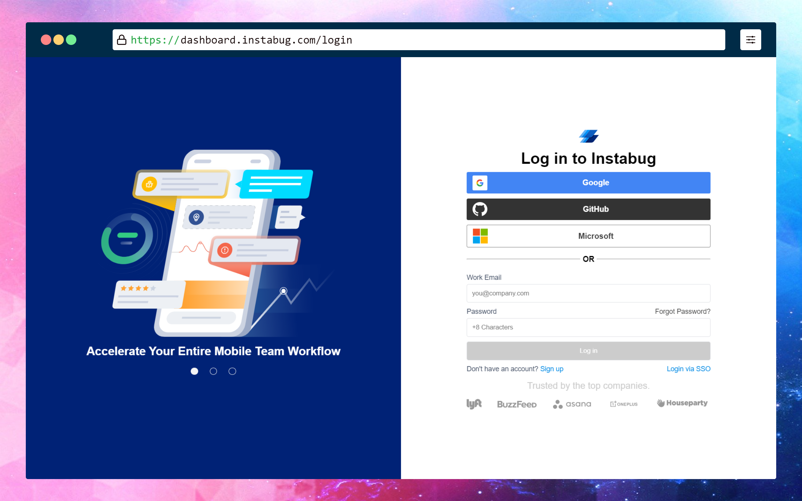
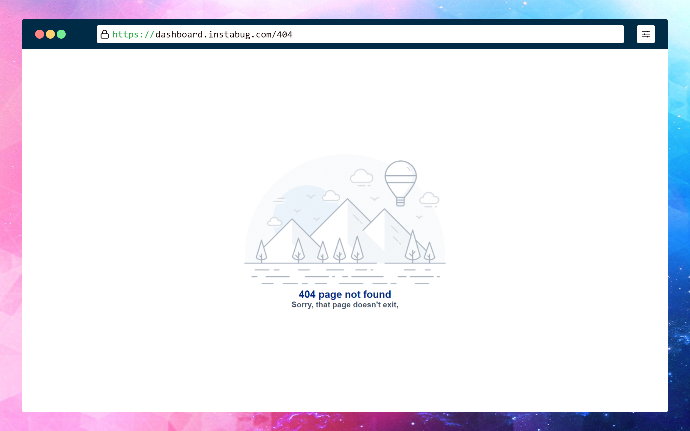
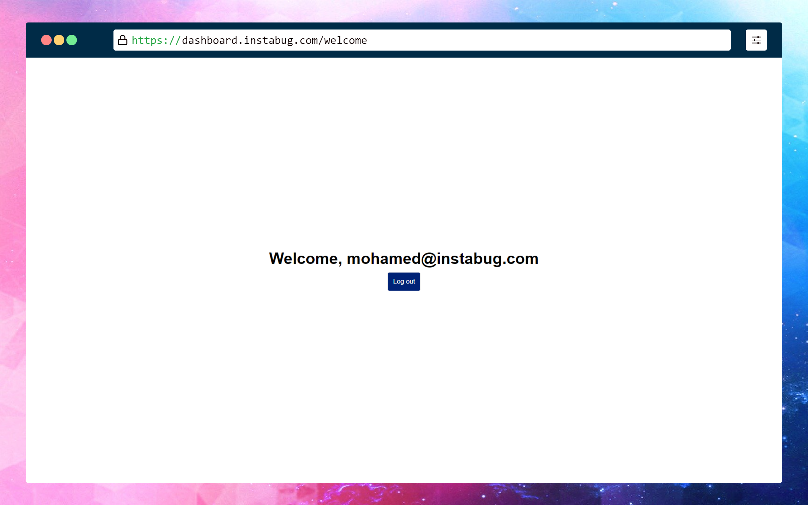

<p align="center">
  <a href="https://deploy-preview-1--brave-williams-505458.netlify.app/">
    
  </a>
  <h2 align="center">Instabug Internship Task</h2>
  <p align="center">
    <br />
    <br />
    <a href="https://deploy-preview-1--brave-williams-505458.netlify.app/"> <strong>View Project</strong></a>
    ·
    <a href="https://github.com/omar-labana/instabug-task/issues">Report Bug</a>
    ·
    <a href="https://github.com/omar-labana/instabug-task/issues">Request Feature</a>
  </p>
</p>

<!-- TABLE OF CONTENTS -->
<details open="open">
  <summary>Table of Contents</summary>
  <ol>
    <li>
      <a href="#about-the-project">About The Project</a>
      <ul>
        <li><a href="#built-with">Built With</a></li>
      </ul>
    </li>
    <li>
      <a href="#getting-started">Getting Started</a>
      <ul>
        <li><a href="#prerequisites">Prerequisites</a></li>
        <li><a href="#installation">Installation</a></li>
      </ul>
    </li>
    <li><a href="#usage">Usage</a></li>
  </ol>
</details>

<!-- ABOUT THE PROJECT -->

## About The Project

<p align="center">
  
&nbsp; &nbsp; &nbsp; &nbsp;
  
&nbsp; &nbsp; &nbsp; &nbsp;
  <br>
  <br>
  
</p>

Three views simulating basic user experience.

Here's what you can find:

- Login page with validation(only for email and password).
- Welcome page is displayed when a user is successfully logged in.
- 404 error page when the user tries to access an invalid URL.

### Built With

- [Vite](https://vitejs.dev/)
- [Vue.js](https://vuejs.org/)
- [cypress](https://www.cypress.io/) for form validation test.

<!-- GETTING STARTED -->

## Getting Started

To get a local copy up and running follow these simple example steps.

### Prerequisites

- Node.js & npm installed.
- Git and any terminal to run commands.

### Installation

1. Clone the repo
   ```sh
   git clone https://github.com/omar-labana/instabug-task.git
   ```
2. Install NPM packages
   ```sh
   npm install
   ```

<!-- USAGE EXAMPLES -->

## Usage

1. Run the dev server
   ```sh
   npm run dev
   ```
2. Open http://localhost:3000/ in your browser
